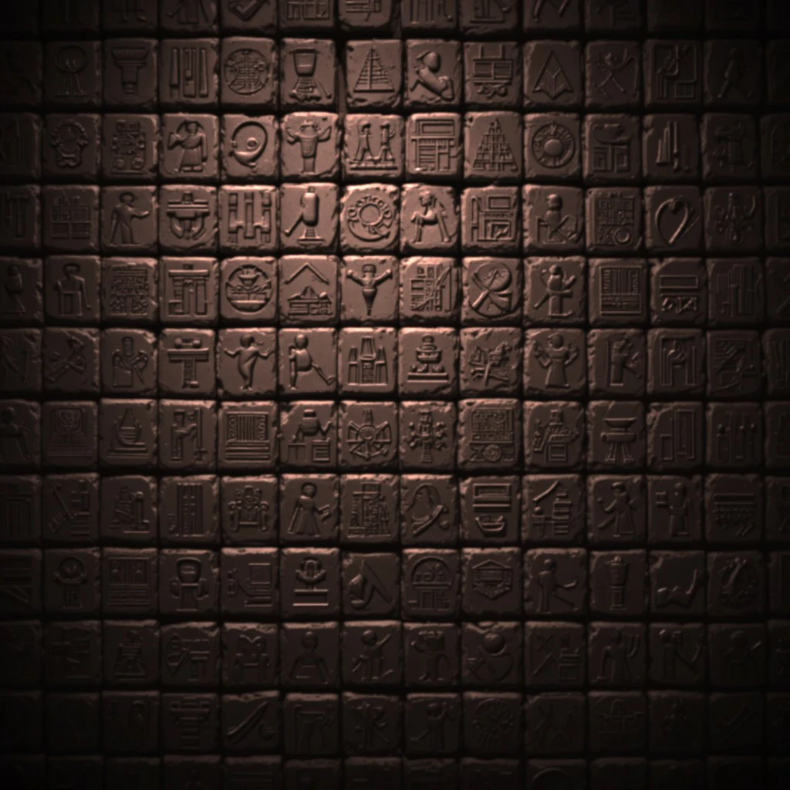

# 🏺 Pyramid Escape

 # 📖 Introduction
**Pyramid Escape** is a single-page adventure game where players solve puzzles and make choices to escape an ancient pyramid created as part of a portfolio project as part of the [Code Institute Full Stack Software Developer Bootcamp](https://codeinstitute.net/). This website blends thematic storytelling with dynamic functionality, showcasing key front-end development skills in HTML5, CSS3, and JavaScript. With pyramid-inspired aesthetics and engaging challenges, users navigate cryptic puzzles, uncover hidden secrets, and experience an immersive journey into the past. The project highlights creativity in web design while reinforcing interactive elements that captivate and educate. Its primary goal is to entertain and challenge visitors while demonstrating advanced styling and scripting techniques.

🔗 Quick Links  
[Live Site](https://ozzymara.github.io/pyramidescape)  
[User Story Board](https://github.com/users/Ozzymara/projects/10)   

## 📜 Table of Contents

- [🗺️ Project Outline](#%EF%B8%8F-project-outline)
  - [🎯 Key Objectives](#-key-objectives)
  - [🧐 UX Design](#-ux-design)
  - [👤 User Stories](#-user-stories)
  - [🎨 Colours](#-colours)
  - [🔠 Fonts](#-fonts)
  - [📱 Wireframes](#-wireframes)
  - [🖼️ Imagery](#%EF%B8%8F-imagery)
- [✨ Features](#-features)
  - [🏷️ Title and Favicon](#%EF%B8%8F-title-and-favicon)
  - [❇️ Splash Screen](#%EF%B8%8F-splash-screen)
  - [🎵 Background Audio Feature](#-background-audio-feature)
  - [🖼️ Image Section](#%EF%B8%8F-image-section)
  - [📜 Story Box](#-story-box)
  - [🔘 Buttons](#-buttons)
  - [🔚 Footer](#-footer)
  - [🕹️ Responsive Website Implementation](#%EF%B8%8F-responsive-website-implementation)
- [🛠️ Built With](#%EF%B8%8F-built-with)
  - [🖥️ Technologies and Languages](#%EF%B8%8F-technologies-and-languages)
  - [📚 Libraries and Frameworks](#-libraries-and-frameworks)
  - [🧰 Tools and Programs](#-tools-and-programs)
  - [⚙️ Related Technologies Used](#%EF%B8%8F-related-technologies-used)
- [🗃️ File Structure](#%EF%B8%8F-file-structure)
- [🧪 Testing and Validation](#-testing-and-validation)
  - [✅ Manual Testing](#-manual-testing)
  - [✅ HTML Validation](#-html-validation)
  - [✅ CSS Validation](#-css-validation)
  - [✅ JS Validation](#-js-validation)
  - [✅ Chrome DevTools Lighthouse](#-chrome-devtools-lighthouse)
  - [✅ Semantic HTML](#-semantic-html)
- [🚀 Deployment](#-deployment)
- [🙌 Credits](#-credits)
  - [⌨️ Code](#%EF%B8%8F-code)
  - [📝 Content](#-content)
  - [🎥 Media](#-media)
  - [🤖 AI Implementation and Orchestration](#-ai-implementation-and-orchestration)
  - [🧡 Acknowledgements](#-acknowledgements)
  - [💡 Future Ideas](#-future-ideas)
  - [🆕 Recent Updates](#-recent-updates)

# 🗺️ Project Outline

 
**Pyramid Escape** is a fully responsive, immersive, single-page web application that transports users into the heart of ancient Egypt. Designed to challenge and engage, this project blends interactive storytelling with puzzle-solving mechanics, guiding users through cryptic hieroglyphics, hidden chambers, and ancient mysteries. Built using HTML5, CSS3, and JavaScript, it showcases dynamic styling and interactive elements that enhance the user experience. With an intuitive interface and engaging design, Pyramid Escape encourages exploration, critical thinking, and discovery, making it both an entertaining and educational journey into the past.

As part of a portfolio project for the [Code Institute Full Stack Software Developer Bootcamp](https://codeinstitute.net/), the project focuses on implementing HTML5, CSS3, JavaScript, and Bootstrap to create a user-centric web experience that meets industry best practices in responsiveness, accessibility, and aesthetics.

🔗 Quick Links  
[Live Site](https://ozzymara.github.io/pyramid-escape)  
[User Story Board](https://github.com/users/Ozzymara/projects/10)

## 🎯 Key Objectives

• **Immerse users in an ancient Egyptian adventure**: create an interactive, thematic experience that transports users into a mysterious pyramid, blending historical symbolism with engaging storytelling.

• **Challenge and engage users**: incorporate dynamic puzzles, cryptic clues, and interactive storytelling elements to provide an engaging escape-room-inspired experience.

• **Offer an intuitive and immersive design**: develop a visually striking interface using a pyramid-inspired aesthetic, including textured backgrounds, thematic animations, and visually distinctive UI components.

• **Ensure accessibility and usability**: adhere to best practices (colour contrast, alt text, semantic HTML) to ensure a seamless experience for all users, regardless of ability or device.

• **Enhance atmospheric storytelling**: integrate narrative-driven elements, symbolic references, and interactive mechanics (such as password validation and jackpot features) to deepen engagement and intrigue.
 

<a href="#-pyramid-escape">Back To Top</a>

# 🧐 UX Design

Designing a website that prioritises mental health requires a thoughtful approach that balances aesthetics, accessibility, and user experience.

## 👤 User stories

I. 🔴 **Must-haves - Site Owner’s Goal**

1.	Design and implement a one-page interactive Front-End web application using HTML, CSS, and JavaScript, focusing on user experience design, accessibility, and responsive DOM manipulation.
2.	Implement interactive features with JavaScript, allowing user control and feedback. Use JavaScript for effective DOM manipulation to dynamically update the single-page interface.	
3.	JavaScript functionality that enables dynamic updates and user interaction on a single page. 
4.	Effective DOM manipulation of at least two elements to reflect changes in real-time based on user actions.
5.	Use CSS media queries to maintain layout integrity across different screen sizes. 
6.	Implement semantic markup for a clear HTML structure.
7.	Ensure the single page features intuitive navigation.
8.	CSS media queries correctly adjust the layout for various screen sizes. 
9.	To implement and document front-end interactivity using core JavaScript, JavaScript libraries, or frameworks with a focus on DOM manipulation for a one-page web application.
10.	Write JavaScript functions implementing compound statements like if conditions and loops. Handle empty or invalid input data intelligently. 

II. 🟠 **External Users’ Goal**

1.	Accessible Navigation: Full keyboard support, focus indicators, and screen reader compatibility
2.	Audio Descriptions or Transcripts: For users with hearing impairments or those in sound-sensitive environments
3.	Readable Visuals and Contrast: Legible text, sufficient colour contrast, and scalable fonts
4.	Mobile Compatibility: Functional layout and interactions on phones and tablets

III. ✅ Should-Haves

1.	A clear objective and narrative for the escape experience
2.	Semantic HTML structure for improved screen reader support
3.	ARIA roles for dynamic elements like buttons and scenes
4.	Keyboard navigation and focus management
5.	Modular JavaScript for clean, maintainable code
6.	Descriptive alt text and labels for visual/audio elements

## 🎨 Colours

The colour palette was carefully selected to enhance the user experience, ensuring both visual appeal and accessibility. Since Pyramid Escape is an interactive, immersive experience, the colours play a crucial role in setting the mood, aiding readability, and creating a harmonious yet engaging aesthetic.

Through extensive research, colour theory principles were applied to achieve a balance between atmosphere, engagement, and usability. The colours were tested using accessibility tools such as the Colour Contrast Checker (also available as a Chrome extension), WebAIM Contrast Checker, and Adobe Color Contrast Analyzer to ensure WCAG compliance and optimal readability.

To guarantee adherence to accessibility standards, the [Colour Contrast Checker](https://colourcontrast.cc/) (also available as a Chrome extension), [WebAIM](https://webaim.org/resources/contrastchecker/) Contrast Checker, and [Adobe Color](https://color.adobe.com/create/color-contrast-analyzer) tools were used to validate contrast levels. These tools helped to make informed decisions regarding the final design.

| Section      | Background        | Hex      | RGB             | Foreground       | Hex      | RGB             | Ratio | AAA Result |
|-------------|------------------|----------|-----------------|------------------|----------|-----------------|---|--| 
| **Title**    | Saddle Brown      | #5d4926  | (93, 73, 38)    | Peach             | #fee7a5  | (254, 231, 165) |7.03| Pass|
| **Story Box**| Licorice Black    | #1f1514  | (31, 21, 20)    | Mint Cream        | #eafbf8  | (234, 251, 248) |16.72|Pass|
| **Buttons**  | Camel             | #c2a86e  | (194, 168, 110) | Jet Black         | #111111  | (17, 17, 17)    |8.2|Pass|

Each colour combination was validated for accessibility, ensuring appropriate contrast levels for readability.

Title Elements: Uses Saddle Brown and Peach, providing a warm, thematic feel while maintaining a 7.03 contrast ratio—above the WCAG AAA standard.

Story Box: Features Liquorice Black and Mint Cream, achieving a high contrast ratio of 16.72, ensuring optimal readability for narrative-driven sections.

Buttons: Styled with Camel and Jet Black, ensuring a strong 8.2 contrast ratio—perfect for interactive elements while remaining visually immersive.

By prioritising visual harmony, contrast compliance, and thematic consistency, Pyramid Escape provides an experience that is both immersive and accessible. The colour choices reinforce the mystical, ancient Egyptian aesthetic while maintaining high readability and usability standards.

Click to view colour palette  

Click to view contrast results  

## 🔠 Fonts

Click to view Papyrus font  

 

Typography plays a crucial role in setting the tone and atmosphere of the game, ensuring an immersive experience for players.

Headings & Body Text – Papyrus (Fantasy)
Both the headings and body text use Papyrus, reinforcing the ancient Egyptian theme. 

Papyrus is a proprietary typeface designed by Chris Costello in 1982 and is commonly pre-installed on some operating systems, but it is not offered as a free web font through Google Fonts. If you want to use Papyrus on the web, you would need to ensure users have it installed on their system or obtain a proper license for web embedding.

The hand-carved, textured letterforms evoke the feeling of weathered hieroglyphics etched into stone, immersing players in the mystery of the pyramid's forgotten secrets.

To enhance readability, the body text is styled with a parchment-like tone, making it easier to absorb while staying true to the game's aesthetics. Subtle shadow effects and spacing adjustments ensure clarity across different screen sizes.

Typography Harmony
Using Papyrus throughout creates a unified thematic experience, maintaining the sense of lost knowledge and ancient magic. Paired with sand-colored accents and glowing effects, this choice strengthens the immersive storytelling and adventure-driven gameplay.

## 📱 Wireframes

Wireframes play a crucial role in shaping a website’s architecture, ensuring a cohesive and well-optimised experience for users. The wireframes for this project have been created using [Balsamiq](https://balsamiq.com/) to define the core feature layout, ensuring a user-friendly experience that prioritises clarity and ease of navigation. These low-fidelity wireframes serve as a foundational guide for structuring the site's design and responsiveness across different screen sizes.

Click to view wireframes mobile, tablet, and desktop

 

## 🖼️ Imagery

The **Pyramid Escape** game utilises carefully selected imagery to create an immersive atmosphere.  All images were generated using [PicLumen](https://piclumen.com/), which is a free AI image generator that transforms text prompts into visually striking images across a variety of styles. 

Background image for the main body

Click to view background image

 
The background image is intended to create an impression of an ancient, mysterious, and intricate wall or surface. The image consists of a repeating pattern of dark-brown, square blocks that cover the entire image. Each block has carved or embossed ancient hieroglyphs. The lighting in the image casts subtle shadows and highlights, enhancing the three-dimensional texture of the carved blocks and giving a sense of depth to the wall of squares.  

Click to view collage of images

  

 
The collage displays 19 AI-generated images depicting various scenes of winding tunnels, large stone pyramids, fire in dark chambers, and water features. One image shows a detailed and ornate circular clock-like device. The images are in a consistent artistic style, with a focus on dramatic lighting and textures. The colour palettes use a mix of warm beige, browns, and dark, shadowy hues, which blend in with the main colour palette for the site.

 

**Accessibility**  

Click to view accessbility score 

  
 

• The alt text for all images refers to the storyboard, meaning that screen readers can describe the images for users who have difficulty seeing.  
• High colour contrast ensures readability for people with vision impairments.  The story box has a high contrast ratio of 16.72, and the buttons have a strong 8.2 contrast ratio – both suitable for optimal readability.  
• Fonts are carefully chosen to be large enough for easy reading.  
• The website uses semantic HTML, which ensures that assistive technologies (such as screen readers) can interpret the content correctly.  

By integrating these images and design enhancements, the site establishes an immersive environment, reinforcing the ancient Egyptian theme while ensuring usability and accessibility for all users.
 

<a href="#-pyramid-escape">Back To Top</a>

 

# ✨ Features

This website is designed for clarity and ease of use and is structured to encourage interaction and decision-making.

## ❇️ Splash Screen

Click to view game title

 

• The splash screen is the first thing users see when they land on the site.  
• The colours black, brown, and beige set the atmosphere of the game.  
• It provides a prominent appearance and sets the tone of the game with the title ‘PYRAMID ESCAPE’ in capitals.  

## 🏷️ Title and Favicon

Click to view browser title

 

• The title of the website, "🏺 Pyramid Escape" appears at the top of the browser tab and at the top of the page. This makes it easy for users to recognise and understand the nature of the game. 

• The favicon (the small icon next to the site title in the browser tab) is an Egyptian pyramid- a universal symbol for ancient Egypt; image courtesy of [Flaticon](https://www.flaticon.com/free-icon/pyramid_1362534). The icon helps users quickly identify the site when they have multiple tabs open. 
• The scrolling title using JavaScript is a great way to display the interactive game; the moving title grabs attention and makes the website stand out with a simple but meaningful effect.

## 🎵 Background Audio Feature
• The game features 
[Egypt Expedition - the kingdom](https://pixabay.com/music/ambient-egypt-expedition-the-kingdom-119123/) by [SamuelFJohanns](https://pixabay.com/users/samuelfjohanns-1207793/) (courtesy of [Pixabay](https://pixabay.com/)) - an atmospheric ambient track inspired by ancient Egypt. It sets a meditative tone with haunting melodies and subtle rhythms that immerse players in a world of forgotten civilisations, temples, and desert mystery.  
• The music autoplays and loops when the game loads.  
• A mute/unmute toggle button (🔊 / 🔇) is fixed in the top-right corner. It allows players to control the audio without needing to navigate away.  
• The button’s state (muted or not) is preserved using localStorage, so user preferences are remembered across sessions.  
• It includes ARIA attributes (aria-pressed and aria-label) to ensure it's accessible for screen reader users.  
• With a hidden transcript provided offscreen, the feature also supports audio accessibility, giving screen reader users descriptive context about the soundscape.  

Click to view audio toggle feature

## 🖼️ Image section

Click to view the images section

 

• This section displays AI-generated images to illustrate the text in the story section.  
• The quotes are displayed within a border that glows.

## 📜 Story Box

Click to view the story box section

 

• [Bootstrap cards](https://getbootstrap.com/docs/5.3/components/card/) are placed in a grid layout, meaning they arrange themselves automatically to fit different screen sizes. On larger screens, they appear side by side, while on smaller screens, they stack vertically.  

## 🔘 Buttons

Click to view the buttons section

 

• There are big, colourful buttons styled with Camel and Jet Black colours, ensuring a strong 8.2 contrast ratio—perfect for interactive elements while remaining visually immersive.  
• These buttons are designed to stand out, making them easy to find.  
• On mobile devices, the buttons are stacked vertically and centred, so they are simple to tap with a finger.  
• Clicking a button triggers the JavaScript function using an event listener through `addEventListener`.  
• On hover, the button glows to display user choice (see top button in image).

## 🔚 Footer

Click to view the footer section

 

• The footer provides users with quick access to the Pyramid Escape game and acknowledges the creators involved in its development. It is implemented using semantic HTML and designed for accessibility and responsive alignment:  
• `<footer>`: Declares the section as the page’s footer, using the `role="contentinfo"` for assistive technologies.  
• `d-flex justify-content-center mt-5`: A Bootstrap utility class combination that centres the footer content with spacing above (mt-5).  
• Each `<a>` tag links to a contributor’s GitHub or the live game and includes an accessible aria-label for screen readers.  
• `<i>` tags use Font Awesome icons styled in a thematic golden hue (#b08a4a) to match the aesthetic of the Pyramid Escape project.

## 🕹️ Responsive Website Implementation

This website is fully responsive, meaning it automatically adjusts to different screen sizes, whether viewed on a mobile phone, tablet, or desktop.

Click to view responsiveness

[Click to view live responsiveness](https://ui.dev/amiresponsive?url=https://ozzymara.github.io/pyramidescape/index.html)  

 

Implementation Details

• The [Bootstrap framework](https://getbootstrap.com)  allowed for a responsive design without the need for additional CSS or media queries.  
• In some instances, responsiveness required fine-tuning and troubleshooting, particularly with the assistance of GitHub Copilot, an AI-powered coding assistant designed to help developers write code more efficiently. It provides real-time code suggestions, automates repetitive tasks, and helps debug and refactor code.  
• While some awkward elements still exist, the site successfully adapts to various screen sizes.
 

<a href="#-pyramid-escape">Back To Top</a>

# 🛠️ Built With  
  
##  🖥️ Technologies and Languages  
  
 The core language for structuring web content.  
  
 A lightweight markup language used for documentation and formatting text.  
 A versatile scripting language used to enable dynamic title scrolling in browsers.  
  
## 📚 Libraries and Frameworks  
  
   A front-end framework for responsive and mobile-friendly design.  
 Provides scalable vector icons for UI design.  

## 🧰 Tools and Programs  
  
   A platform for version control and collaborative development.  
  Used for creating wireframes and planning UI layouts.  
  An AI assistant that enhances productivity and creative workflows.  
 AI-powered code completion to assist with coding tasks.  
 A code editor used for writing, debugging, and version control.  
  A set of web development tools built directly into Google Chrome for debugging and optimising websites.  
 AI text to image creator.  
 Site for free icons and stickers for projects.

## ⚙️ Related Technologies Used  
 Helps visualise and plan web designs before development.  
   Ensures the code follows web standards for accessibility and correctness.  
 Used to audit and optimise web applications for speed and accessibility.  
 ECMAScript 6 Checker.  
 Used to audit and optimise web applications for speed and accessibility.  
 JavaScript code quality control.  
 Evaluation tool that helps authors make their web content more accessible to individuals with disabilities. 
 Syntax Validator that checks for mistakes and errors.  
   A tool for previewing how websites appear on different screen sizes and devices.  
  Integrates with GitHub to track changes and manage projects efficiently.  
  

<a href="#-pyramid-escape">Back To Top</a>
  

## 🗃️ File Structure  
Pyramid Escape 
├── index.html  
├── game.html  
├── README.md  
├── assets/  
│ ├── audio/  
│ ├── css/  
│ └── images/  
│ └── js/  

 

<a href="#-pyramid-escape">Back To Top</a>

# 🧪 Testing and Validation

**Overview**  
Throughout the course of the project, testing and validation were conducted to ensure functionality, responsiveness, and usability. Importantly, testing in Incognito Mode is crucial because it provides a clean testing environment without cached data, stored cookies, or browser extensions interfering with the site’s URL. Essentially, it mimics a first-time visitor's experience, making sure the site works as expected for new users without any hidden browser influences.

**Testing Methods**  
• *Debugging and Browser Tools*: Regular debugging and testing were performed using [Chrome DevTools](https://developer.chrome.com/docs/devtools) to analyse and troubleshoot issues efficiently.  
<!-- • Testing Sheet: A structured approach was followed using the MHA testing sheet (Google read-only) to verify compliance and accessibility.   -->
• *Peer Code Review*: The team provided a "fresh set of eyes" through peer code reviews, helping identify potential issues that were overlooked.

## ✅ Manual Testing

1. **Navigation**  
   o Verified links hover effects  
   o Verified all navigation links work correctly  
   o Tested responsiveness on multiple devices  
2. **Responsiveness**
   All tests were conducted in [Chrome DevTools](https://developer.chrome.com/docs/devtools), using the device toolbar for the following customised dimensions:

   o Mobile from 360x640 to 414x896  
   o Tablets from 601x962 to 1280x800  
   o Laptops 1280x720 to 1920x1080

## [✅ HTML Validation](https://validator.w3.org/#validate_by_input)

The website currently has no errors.

Click to view HTML validation results

[Click to view live index validation](https://validator.w3.org/nu/?doc=https%3A%2F%2Fozzymara.github.io%2Fpyramidescape%2Findex.html)  
[Click to view live game page validation](https://validator.w3.org/nu/?doc=https%3A%2F%2Fozzymara.github.io%2Fpyramidescape%2Fgame.html)

 

When MS Copilot generated code, occasional stray elements like &lt;/span&gt; and other closing tags appeared due to the way it predicted and completed code snippets. These errors were flagged during HTML validation and were corrected in [VS Code](https://code.visualstudio.com/download).

Additionally, the use of explicit ARIA role attributes (e.g. role="button", role="main") on HTML elements was initially guided by recommendations from the WAVE accessibility tool. However, these roles are inherently implied by the semantic HTML5 elements themselves. The Nu HTML Validator correctly flags them as unnecessary. To ensure leaner, more semantic code and to align with modern best practices, we chose to deselect checking redundant role attributes. Resultantly, the current version of the game shows no errors.

## [✅ CSS Validation](https://jigsaw.w3.org/css-validator/#validate_by_input)

Click to view CSS validation results

[Click to view live CSS validation](https://jigsaw.w3.org/css-validator/validator?uri=https%3A%2F%2Fozzymara.github.io%2Fpyramidescape%2Fassets%2Fcss%2Fstyle.css&profile=css3svg&usermedium=all&warning=1&vextwarning=&lang=en)  

 

No errors found

This document validates as CSS level 3 + SVG.

## [✅ JS Validation](https://jshint.com/)

*Process*: JavaScript files were validated using several validators.

The longer the work on a project, the larger the codebase becomes, so by validating JavaScript code regularly, the benefits include:  
•	Catch fundamental errors  
•	Prevents potentially disastrous bugs  
•	Have cleaner, safer, and maintainable code  
•	Speed up the code-writing process  
•	Save many hours of debugging  

To ensure code clarity, consistency, and maintainability across all modern environments, I ran the project through four independent linters:

1.	Piliapp JavaScript Validator

Click to view Piliapp validation results

 

Piliapp was used as a quick JavaScript validator for a fast, browser-based scan to catch obvious syntax issues. This linter offers visual error highlights and cross-checking for compatibility or missed typos across versions.

2. JS Lint

Click to view JS Lint validation results

 

JSLint was then used to enforce strict style and enforce structure. It enforces Douglas Crockford’s original best practices and guards against unsafe language features. Furthermore, JS Lint  catches deep structural or stylistic flaws early.

During the initial linting phase via JS Lint, the project generated 49 warnings from JSLint, primarily related to formatting, line length, and environment assumptions. To streamline development without compromising code quality:  
•	Line length and whitespace rules were relaxed to allow more flexibility in layout and readability. This brought the warning count down to 14.  
•	Activating the “Assume a browser” environment option resolved the remaining warnings by informing JSLint that browser-specific globals (like window, document, etc.) are intentional and valid in this context.  

With these configurations, the project now passes linting with zero warnings, ensuring both clarity and compatibility while remaining tuned for a web-based experience.

3. JS Hint

Click to view JS Hint validation results

 

JS Hint – Having addressed the strictness test via JS Lint, JS Hint provides a more relaxed response to JavaScript issues. Because this project uses a modern script, JS Hint was configured to allow 'New JavaScript features (ES6)'. No errors are found in the current version of the game.

4. WAVE

Click to view WAVE results

 

WAVE (Web Accessibility Evaluation Tool) Accessibility was used to audit for the HTML and UI, which scans the rendered page for issues like missing alt text, poor contrast, and improper heading structure. The focus is on the way the output serves users with disabilities. 
No errors are detected in the current version. 

5.	Esprima

Click to view Piliapp validation results

 

Esprima Validator was used as an additional check for broader JS compatibility. This linter offers visual error highlights and cross-checking for compatibility or missed typos across versions. No errors were found in the current version of the game.

## [✅ Chrome DevTools Lighthouse](https://developers.google.com/web/tools/lighthouse/)
• A Lighthouse audit was conducted using the tool on Chrome DevTools for each web page.  
• Categories *Performance*, *Accessibility*, *Best Practices*, and *SEO* all have a score of 100 were found in the current version of the game.

Mobile

Click to view Lighthouse results for mobile

 

Desktop

Click to view Lighthouse results for desktop

 
 

Testing Results:

In-depth testing has been carried out, and all results are shown below in the test results sheet:

Click to view test grid

 

This test sheet displays the results of responsiveness and validation tests conducted across various devices and browsers. The tests confirm that key elements such as the buttons, password recognition, and jackpot function correctly on Chrome, Firefox, Safari, iPhone Xr, and iPad. Additionally, CSS and HTML validation have passed successfully.

## ✅ Semantic HTML
This project uses semantic HTML elements throughout to enhance accessibility and ensure a logical structure for all users, including those using assistive technologies.

**How Semantic HTML is Applied in This Project:**  

1.	**Key elements**  
o	✅ `<!DOCTYPE html>`, `<html lang="en">`, and `<meta>` tags are well-formed  
o	✅ `<main>`, `<header>`, `<footer>` are used appropriately  
o	✅ Clear alt text for the main image  
o	✅ Consistent `type="button"` on all interactive buttons  
o	✅ Mute toggle is intuitive and accessible with aria-label and icon  

2.	**Solid Accessibility Setup**  
o	Screen readers can interpret page structure clearly  
o	Button functionality is clear and visually expressed  
o	Uses visually appropriate layout and contrast supported by CSS  

3.	**Maintainability and UX Considerations**  
o	Use of localStorage for persistent settings and music toggle  
o	Scrolling logic based on interaction  
o	`<script>` organisation is clean and componentised

- **Key Elements:**  
  - `<nav>` is used for the navigation bar, helping screen readers identify the main site navigation.
  - `<header>` contains the hero section and site introduction.
  - `<section>` is used to group related content, such as information cards, resources, and quotes.
  - `<footer>` provides consistent site information and links at the bottom of the page.

**Example of semantic HTML from this project:**

Click to view examples of semantic HTML from the initial version of this project

 

By using these semantic elements, the site is easier to navigate, more accessible to assistive technologies, and better aligned with web standards.
   

<a href="#-pyramid-escape">Back To Top</a>
  

# 🚀 Deployment

This project was developed using Visual Studio Code (VS Code) and version-controlled via GitHub. The main branch serves as the live deployment source.

**Features**  
Developed in [VS Code](https://code.visualstudio.com/download)    
Managed with [GitHub](https://github.com/)  
Deployed from the main root branch  
Live and accessible online

**Prerequisites**
Ensure you have the following installed:  
[VS Code](https://code.visualstudio.com/download)  
[Git](https://git-scm.com/downloads) 
Node.js (if applicable)  
A [GitHub](https://github.com/) account  

Live streaming in [VS Code](https://code.visualstudio.com/download) using the [Live Server](https://marketplace.visualstudio.com/items?itemName=ritwickdey.LiveServer) extension (created by Ritwick Dey) is helpful because it automatically refreshes your browser as soon as you save your file, thereby displaying the latest changes in real-time.
Steps to Run Locally Using VS Code Live Server

1. Install [Live Server](https://marketplace.visualstudio.com/items?itemName=ritwickdey.LiveServer) Extension on Open [VS Code](https://code.visualstudio.com/download).
2. Go to the Extensions tab (Ctrl+Shift+X).
3. Search for "Live Server" and install it.
4. Open Your Project
5. Open the folder containing your project in [VS Code](https://code.visualstudio.com/download) (File > Open Folder).
6. Ensure your project has an index.html file or another HTML entry point.
7. Start Live Server
8. Right-click on your index.html file and select "Open with Live Server".
9. Alternatively, you can go to the bottom-right corner of [VS Code](https://code.visualstudio.com/download) and click "Go Live".
10. View Your Project
11. This will open your project in the default browser.
12. Any changes you make to the code will automatically update in the browser.

Setup & Installation

1. Open in [VS Code](https://code.visualstudio.com/download)
2. Navigate to the project folder
3. Run `code .` in the terminal to launch [VS Code](https://code.visualstudio.com/download)
4. Make changes and commit
5. Modify files as needed
6. Stage changes: `git add .`
7. Commit: `git commit -m "Initial setup"`
8. Push to GitHub: `git push	`
9. git push origin main

Deployment

1. GitHub Pages (if applicable)
2. Go to GitHub repository settings
3. Enable GitHub Pages from the main branch
4. Wait for the site to go live
5. View the live project [here](https://ozzymara.github.io/pyramidescape/).

Contribution and Feedback
Report issues or suggest improvements via GitHub Issues.
 

<a href="#-pyramid-escape">Back To Top</a>

# 🙌 Credits

## ⌨️ Code
• The boxes and buttons were built with [Bootstrap feature](https://getbootstrap.com/docs/5.3).  
• The website utilises the Bootstrap framework for responsive design and styling components.  
• The project was inspired by previous projects shared via the Code Institute, especially the work ‘[Tales of Motion: Goldilocks and The Three Bears](https://ashleytosullivan.github.io/goldilocks-adventure/)' by [Jago]( https://github.com/Jxg0Tr5), [Ashleytosullivan]( https://github.com/Ashleytosullivan), and [Megan Otton]( https://github.com/MeganOtton).  
• Learning and parts of code were supplied by Github Copilot.

## 📝 Content
The text content was generated using AI and Google search.
The icons in the footer were from Font Awesome.

## 🎥 Media
The images were downloaded from [PicLumen]( https://piclumen.com/app/image-generator/explore). Emojis from Icons used on the website, such as the social media icons in the footer, were sourced from [Font Awesome](https://fontawesome.com/), a popular icon library. Static badges for README documentation [Shields.io](https://shields.io/badges/static-badge) & [Simple Icons](https://simpleicons.org/)

## 🤖 AI Implementation and Orchestration

**Use Cases and Reflections** 

**Code Creation** 

*   **Reflection:** AI tools, especially GitHub Copilot, were leveraged to accelerate the development of HTML, CSS, and JS components, Bootstrap layouts, and responsive design patterns. This enabled rapid prototyping and allowed for more time to focus on accessibility and user experience. 
*   **Examples:** Copilot generated initial structures for the JavaScript functions. It also provided suggestions for semantic HTML and ARIA attributes to improve accessibility. 
 
**Debugging** 

*   **Reflection:** AI assistance was instrumental in identifying and resolving HTML validation errors, fixing accessibility issues, and ensuring proper tag nesting and structure. 
*   **Examples:** Copilot Chat helped troubleshoot issues such as unclosed tags, improper heading order, and missing alt text. It also suggested fixes for responsive layout bugs and CSS specificity conflicts. 

**Performance and UX Optimisation** 

*   **Reflection:** AI-driven recommendations were used to enhance site performance and user experience, particularly around responsive design and accessibility best practices. 
*   **Examples:** Copilot suggested improvements like using high-contrast color schemes, optimising font sizes for readability, and ensuring keyboard navigability for all interactive elements. 

**Automated Testing and Validation** 

*   **Reflection:** AI tools supported the validation process by providing checklists and reminders for HTML and CSS validation, as well as accessibility audits. 
*   **Examples:** Copilot generated code snippets for manual testing steps and validation routines, ensuring that all images and buttons were accessible and functional across devices. 

**Documentation Writing** 

*   **Reflection:** AI tools streamlined the creation of project documentation, offering clear and concise explanations for setup, deployment, and feature descriptions. 
*   **Examples:** Copilot was used to draft README sections, including installation instructions, feature overviews, and accessibility notes, ensuring the documentation was comprehensive and user-friendly. 

**Overall Impact** 

*   **Efficiency Gains:** The use of AI tools significantly reduced development time, automated repetitive tasks, and improved code quality. This allowed for a greater focus on design, accessibility, and user experience. 
*   **Challenges:** Occasional contextual adjustments were needed for AI-generated code, particularly to align with accessibility standards and project-specific requirements. These were resolved through iterative testing and manual review.
 

<a href="#-pyramid-escape">Back To Top</a>

## 🧡 Acknowledgements

Team members:  
• [David](https://github.com/DavidShergold) for extending the story narrative, creating the wireframes, and the scroll and sound toggle features.  
• [Andrea](https://github.com/AndreaFitz) for checking the user stories and working on alternative designs considered during the creation of the site. 

Feedback from external users:  
• [Megan](https://github.com/MeganOtton), whose kind words and support felt like a generous lending of her blessings to adapt and carry the project forward:  
       *"Thank you so much! I'm glad our project inspired you! I absolutely love what you've made! ... It's really brilliant! that's made my day!"*  
• [Mark](https://github.com/markrshaw99) for providing constructive feedback on user experience and navigation;  
       *"Absolutely fantastic Ozzy! Tell your group massive congrats from me! Happy to help and congrats on the astonishingly rapid progress!"*  

A special thank you also to: 
• [Dillon](https://github.com/dillon-mccaffrey-ci) for his insightful guidance on surfacing hidden issues in GitHub that escape detection in VS Code, helping elevate the project’s reliability.  
• [Roo](https://github.com/roomacarthur) for generously sharing expertise in manual testing and encouraging thoughtful attention to sound toggle edge cases, which sharpened the user experience.  
• [Kevin](https://github.com/kevin-ci) for skillfully demonstrating how to harness JavaScript logic and dynamic features in ways that inspired more robust, interactive design.  

## 💡 Future ideas:

• Include a light/dark mode feature  
• Side-by-side view of the image and story box in laptop and desktop modes  
• Set a timer and difficulty level  
• Include a progress tracking feature
• Include a completion feedback section
• Include optional bonus rooms
• Allow customisable themes
• Resolve storage capacity issue to allow updates

Click to view provisional design for future updates

 

## 🆕 Recent Updates

Updates have yet to be implemented since the site's deployment on 23rd June 2025.

<a href="#-pyramid-escape">Back To Top</a>

